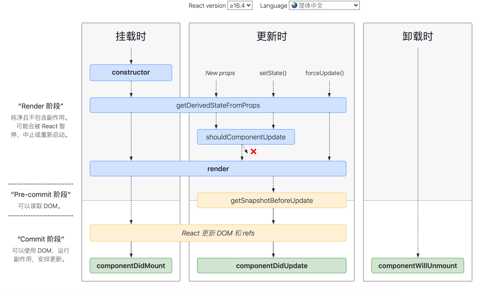

# React的生命周期笔记

## react的生命周期方法
- 挂载
   - constructor()
   - static getDerivedStateFromProps(props, state)
   - render()
   - componentDidMount()
- 更新
   - static getDerivedStateFromProps(props, state)
   - shouldComponentUpdate(nextProps, nextState)
   - render()
   - getSnapshotBeforeUpdate(prevProps, prevState)
   - componentDidUpdate()
- 卸载
   - componentWillUnmount()

<br>
其中这些方法即将过时，应该避免使用他们

- UNSAFE_componentWillMount()
- UNSAFE_componentWillUpdate()
- UNSAFE_componentWillReceiveProps()

具体的流程图如下:<br>
  <br><br>

地址是这个：https://projects.wojtekmaj.pl/react-lifecycle-methods-diagram/


## static getDerivedStateFromProps(props, state)
这是个新生命周期方法，需要注意三点：
- 第一个重点是最特别的一点：**getDerivedStateFromProps 是一个静态方法**。静态方法不依赖组件实例而存在，**因此你在这个方法内部是访问不到 this 的**。若你偏要尝试这样做，必定报错。
- 该方法可以接收两个参数：props 和 state，它们分别代表**当前组件接收到的来自父组件的 props** 和 **当前组件自身的 state**。
- getDerivedStateFromProps 需要一个对象格式的返回值。且返回值是不可或缺的，因为 React 需要用这个返回值来更新（派生）组件的 state。因此当你确实不存在“使用 props 派生 state ”这个需求的时候，最好是直接省略掉这个生命周期方法的编写，否则一定记得给它 return 一个 null。

注意，**getDerivedStateFromProps 方法对 state 的更新动作并非“覆盖”式的更新，而是针对某个属性的定向更新**。
比如，在getDerivedStateFromProps方法里返回：
```
{num: props.text}
```
只会更新state的num属性，并不会覆盖生个state。

## getSnapshotBeforeUpdate(prevProps, prevState)
**getSnapshotBeforeUpdate 的返回值会作为第三个参数给到 componentDidUpdate。它的执行时机是在 render 方法之后，真实 DOM 更新之前**。在这个阶段里，我们可以同时获取到更新前的真实 DOM 和更新前后的 state&props 信息。从生命周期图中可以看到，getSnapshotBeforeUpdate执行后才会真正更新DOM，也就是说在如果在这个方法获取DOM，拿到的DOM还是未更新的旧的DOM。

componentDidUpdate(prevProps, prevState, valueFromSnapshot)，第三个参数就是getSnapshotBeforeUpdate的返回值。**getSnapshotBeforeUpdate 要想发挥作用，离不开 componentDidUpdate 的配合**。

## 组件销毁的常见原因有以下两个
- **组件在父组件中被移除了**：这种情况相对比较直观，对应的就是我们上图描述的这个过程。
- **组件中设置了 key 属性，父组件在 render 的过程中，发现 key 值和上一次不一致，那么这个组件就会被干掉**。


## 新生命周期背后的思考
在 Fiber 机制下，render 阶段是允许暂停、终止和重启的。当一个任务执行到一半被打断后，下一次渲染线程抢回主动权时，这个任务被重启的形式是“重复执行一遍整个任务”而非“接着上次执行到的那行代码往下走”。这就导致 render 阶段的生命周期都是有可能被重复执行的。

带着这个结论，我们再来看看 React 16 打算废弃的是哪些生命周期：
- componentWillMount；
- componentWillUpdate；
- componentWillReceiveProps。

这些生命周期的共性，就是它们都处于 render 阶段，都可能重复被执行，而且由于这些 API 常年被滥用，它们在重复执行的过程中都存在着不可小觑的风险。


[官方文档对React.Component中的生命周期的讲解](https://zh-hans.reactjs.org/docs/react-component.html)

[官方文档关于需不需要使用派生state,getDerivedStateFromProps方法相关的讲解](https://zh-hans.reactjs.org/blog/2018/06/07/you-probably-dont-need-derived-state.html)