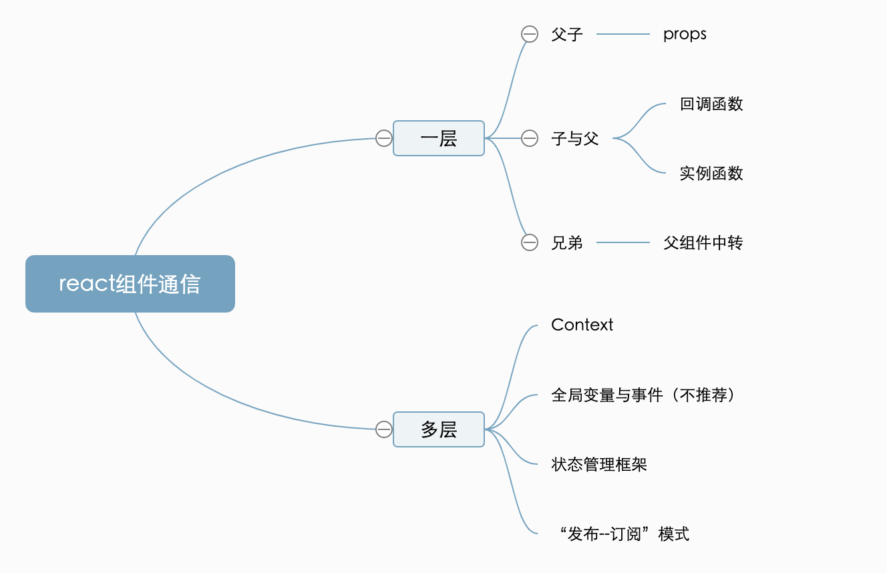

# react组件跨层通信 笔记

## 组件与组件之间的关系，大致可分为 4 种。

1. 父与子：父组件包裹子组件，父组件向子组件传递数据。

2. 子与父：子组件存在于父组件之中，子组件需要向父组件传递数据。

3. 兄弟：两个组件并列存在于父组件中，需要金属数据进行相互传递。

4. 无直接关系：两个组件并没有直接的关联关系，处在一棵树中相距甚远的位置，但需要共享、传递数据。

通信方式总结如下：<br>
  <br><br>

### 父与子
**父与子的通信主要是通过props**。React 开发的每个组件都在使用这样的设计模式。每个组件都会在父级被使用，再传入 Props，完成信息的传递。这样的交互方式尽管不起眼，容易让人忽略，但正是最经典的设计。

### 子与父
子与父的通信主要依赖**回调函数**。
#### 回调函数
回调函数在 JavaScript 中称为 callback。React 在设计中沿用了 JavaScript 的经典设计，允许函数作为参数赋值给子组件。最基础的用法就像下面的例子一样，通过包装传递 text 的值。
```javascript
class Child  extends React.Component {
   handleChanged = (e) => {
       //调用父组件传进来的回调函数
     this.props.onChangeText(e.target.text)
   }
   render() {
     return <input onChange={handleTextChanged} />
   }
}

class Father extends React.Component {
   handleTextChanged = (text) => {
     console.log(text)
   }
    render() {
        return (
            // 把函数当做props参数传给子组件
            <Child onChangeText={this.handleTextChanged} />
        )
    }
}
```
#### 实例函数
需要注意的是，实例函数是一种**不被推荐的使用方式**。这种通信方式常见于 React 流行初期，那时有很多组件都通过封装 jQuery 插件生成。最常见的一种情况是在 Modal 中使用这种方式。如下代码所示：
```javascript
import React from 'react'
class HomePage extends React.Component {
   modalRef = React.createRef()
   showModal = () ={
     this.modalRef.show()
   }
   hideModal = () => {
    //通过ref获取到的实例操作，不过现在一般都不这么用了，现在会给一个参数show=true或show=false来控制组件显示或者隐藏
     this.modalRef.hide();
   }
    render() {
        const {
          text
        } = this.state
        return (
            <>
              <Button onClick={this.showModal}>展示 Modal </Button>
              <Button onClick={this.hideModal}>隐藏 Modal </Button>
              <Modal ref={modalRef} />
            </>
          />
        )
    }
```

### 兄弟
兄弟组件之间的通信，往往**依赖共同的父组件进行中转**。也就是状态提升。

### 无直接关系
无直接关系就是两个组件的直接关联性并不大，它们身处于多层级的嵌套关系中，既不是父子关系，也不相邻，并且相对遥远。他们之前通信的方式有：

1. **Context**，即React 的 Context API。
2. **全局变量与事件**（不太推荐）。全局变量，顾名思义就是放在 Window 上的变量。但值得注意的是修改 Window 上的变量并不会引起 React 组件重新渲染。
3. **状态管理框架**。状态管理框架提供了非常丰富的解决方案，常见的有 Flux、Redux 及 Mobx。
4. **“发布-订阅”模式**

### “发布-订阅”模式
“发布-订阅”模式可谓是解决通信类问题的“万金油”，使用发布-订阅模式的优点在于，监听事件的位置和触发事件的位置是不受限的，就算相隔十万八千里，只要它们在同一个上下文里，就能够彼此感知。这个特性，太适合用来应对“任意组件通信”这种场景了。
#### 发布-订阅模型 API 设计思路
- on()：负责注册事件的监听器，指定事件触发时的回调函数。

- emit()：负责触发事件，可以通过传参使其在触发的时候携带数据 。

- off()：负责监听器的删除。


#### 发布-订阅模型编码实现(重要，面试考点)

“发布-订阅”模式不仅在应用层面十分受欢迎，它更是面试官的心头好。在涉及设计模式的面试中，如果只允许出一道题，那么我相信大多数的面试官都会和我一样，会毫不犹豫地选择考察“发布-订阅模式的实现”。

在写代码之前，先要捋清楚思路。这里我把“实现 EventEmitter”这个大问题，拆解为 3 个具体的小问题，下面我们逐个来解决。

- 问题一：事件和监听函数的对应关系如何处理？

提到“对应关系”，应该联想到的是“映射”。在 JavaScript 中，处理“映射”我们大部分情况下都是用对象来做的。所以说在全局我们需要设置一个对象，来存储事件和监听函数之间的关系：
```javascript
constructor() {
  // eventMap 用来存储事件和监听函数之间的关系

  this.eventMap= {}

}
```
- 问题二：如何实现订阅？

所谓“订阅”，也就是注册事件监听函数的过程。这是一个“写”操作，具体来说就是把事件和对应的监听函数写入到 eventMap 里面去：
```javascript
// type 这里就代表事件的名称
on(type, handler) {

  // hanlder 必须是一个函数，如果不是直接报错
  if(!(handler instanceof Function)) {
    throw new Error("哥 你错了 请传一个函数")
  }

  // 判断 type 事件对应的队列是否存在
  if(!this.eventMap[type]) {
   // 若不存在，新建该队列
    this.eventMap[type] = []
  }

  // 若存在，直接往队列里推入 handler
  this.eventMap[type].push(handler)
}
```
- 问题三：如何实现发布？

订阅操作是一个“写”操作，相应的，发布操作就是一个“读”操作。发布的本质是触发安装在某个事件上的监听函数，我们需要做的就是找到这个事件对应的监听函数队列，将队列中的 handler 依次执行出队：
```javascript
// 别忘了我们前面说过触发时是可以携带数据的，params 就是数据的载体
emit(type, params) {

  // 假设该事件是有订阅的（对应的事件队列存在）
  if(this.eventMap[type]) {
    // 将事件队列里的 handler 依次执行出队
    this.eventMap[type].forEach((handler, index)=> {

      // 注意别忘了读取 params
      handler(params)
    })
  }
}
```

到这里，最最关键的 on 方法和 emit 方法就实现完毕了。最后我们补充一个 off 方法：
```javascript
// 监听器的删除
/*
>>> 是无符号按位右移运算符。考虑 indexOf 返回-1 的情况：splice方法喜欢把-1解读为当前数组的最后
一个元素，这样子的话，在压根没有对应函数可以删的情况下，不管三七二十一就把最后一个元素给干掉了。
而 >>> 符号对正整数没有影响，但对于-1来说它会把-1转换为一个巨大的数（你可以本地运行下试试看，
应该是一个32位全是1的二进制数，折算成十进制就是 4294967295）。这个巨大的索引splice是找不到的，
找不到就不删，于是一切保持原状，刚好符合我们的预期。
*/
off(type, handler) {

  if(this.eventMap[type]) {

    this.eventMap[type].splice(this.eventMap[type].indexOf(handler)>>>0,1)
  }
}
```

接着把这些代码片段拼接进一个 class 里面，一个核心功能完备的 EventEmitter 就完成啦：
```javascript
class myEventEmitter {

  constructor() {
    // eventMap 用来存储事件和监听函数之间的关系
    this.eventMap = {};
  }

  // type 这里就代表事件的名称
  on(type, handler) {

    // hanlder 必须是一个函数，如果不是直接报错
    if (!(handler instanceof Function)) {
      throw new Error("哥 你错了 请传一个函数");
    }

    // 判断 type 事件对应的队列是否存在
    if (!this.eventMap[type]) {
      // 若不存在，新建该队列
      this.eventMap[type] = [];
    }

    // 若存在，直接往队列里推入 handler
    this.eventMap[type].push(handler);
  }

  // 别忘了我们前面说过触发时是可以携带数据的，params 就是数据的载体
  emit(type, params) {

    // 假设该事件是有订阅的（对应的事件队列存在）
    if (this.eventMap[type]) {

      // 将事件队列里的 handler 依次执行出队
      this.eventMap[type].forEach((handler, index) => {

        // 注意别忘了读取 params
        handler(params);
      });
    }
  }

// 监听器的删除
/*
>>> 是无符号按位右移运算符。考虑 indexOf 返回-1 的情况：splice方法喜欢把-1解读为当前数组的最后
一个元素，这样子的话，在压根没有对应函数可以删的情况下，不管三七二十一就把最后一个元素给干掉了。
而 >>> 符号对正整数没有影响，但对于-1来说它会把-1转换为一个巨大的数（你可以本地运行下试试看，
应该是一个32位全是1的二进制数，折算成十进制就是 4294967295）。这个巨大的索引splice是找不到的，
找不到就不删，于是一切保持原状，刚好符合我们的预期。
*/
  off(type, handler) {
    if (this.eventMap[type]) {

      this.eventMap[type].splice(this.eventMap[type].indexOf(handler) >>> 0, 1);
    }
  }
}
```

下面我们对 myEventEmitter 进行一个简单的测试，创建一个 myEvent 对象作为 myEventEmitter 的实例，然后针对名为 “test” 的事件进行监听和触发：
```javascript
// 实例化 myEventEmitter
const myEvent = new myEventEmitter();

// 编写一个简单的 handler
const testHandler = function (params) {

  console.log(`test事件被触发了，testHandler 接收到的入参是${params}`);

};

// 监听 test 事件
myEvent.on("test", testHandler);

// 在触发 test 事件的同时，传入希望 testHandler 感知的参数
myEvent.emit("test", "newState");

```

现在你可以试想一下，对于任意的两个组件 A 和 B，假如我希望实现双方之间的通信，借助 EventEmitter 来做就很简单了，以数据从 A 流向 B 为例。

我们可以在 B 中编写一个handler（记得将这个 handler 的 this 绑到 B 身上），在这个 handler 中进行以 B 为上下文的 this.setState 操作，然后将这个 handler 作为监听器与某个事件关联起来。比如这样：
```javascript
// 注意这个 myEvent 是提前实例化并挂载到全局的，此处不再重复示范实例化过程
const globalEvent = window.myEvent

class B extends React.Component {

  // 这里省略掉其他业务逻辑
  state = {
    newParams: ""
  };

  handler = (params) => {
    this.setState({
      newParams: params
    });
  };

  bindHandler = () => {
    globalEvent.on("someEvent", this.handler);
  };

  render() {
    return (
      <div>
        <button onClick={this.bindHandler}>点我监听A的动作</button>
        <div>A传入的内容是[{this.state.newParams}]</div>
      </div>
    );
  }
}
```
接下来在 A 组件中，只需要直接触发对应的事件，然后将希望携带给 B 的数据作为入参传递给 emit 方法即可。代码如下：
```javascript
class A extends React.Component {

  // 这里省略掉其他业务逻辑
  state = {
    infoToB: "哈哈哈哈我来自A"
  };

  reportToB = () => {
    // globalEvent从全局对象window获取
    // 这里的 infoToB 表示 A 自身状态中需要让 B 感知的那部分数据
    globalEvent.emit("someEvent", this.state.infoToB);
  };

  render() {
    return <button onClick={this.reportToB}>点我把state传递给B</button>;
  }
}
```
如此一来，便能够实现 A 到 B 的通信了。这里我将 A 与 B 编排为兄弟组件，代码如下：
```javascript
export default function App() {
  return (
    <div className="App">
      <B />
      <A />
    </div>
  );
}
```

**你需要把重点放在对编码的实现和理解上，尤其是基于“发布-订阅”模式实现的 EventEmitter，多年来一直是面试的大热点，务必要好好把握。**

这个发布-订阅模式是我买的专栏里讲的，我觉讲的比较好，就直接拿过来了，我觉得老师的功底还是挺深厚的，就是课程数量有点少，感觉把有些内容拿出来精讲一下就好了。下面的二维码就是课程，有需要的同学可以自己买来看看。
