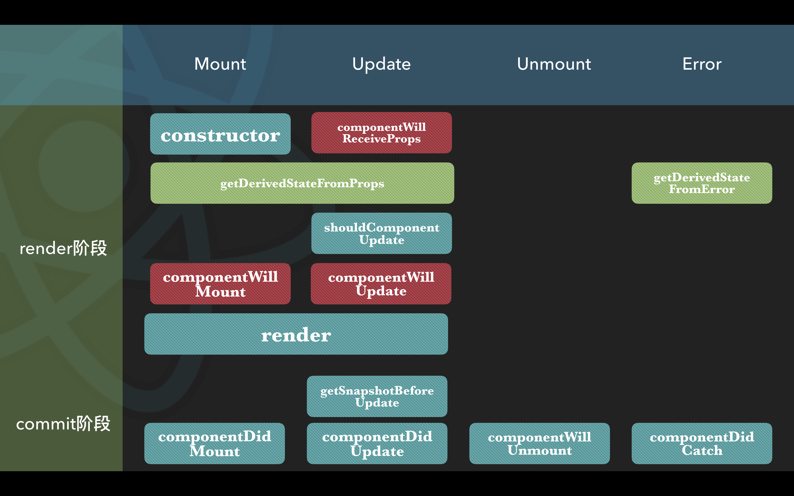

# react相关的3个面试题
## setState是同步还是异步？
- legacy模式，命中batchedUpdates时是异步
- legacy模式，未命中batchedUpdates时是同步
   - 比如：用setTimeout包裹setState函数
- concurrent模式都是异步

`legacy模式 -- ReactDOM.render(<App />, rootNode)`

`concurrent模式 -- ReactDOM.createRoot(rootNode).render(<App />)`

## react的声明周期函数
    
标红的是即将过时，应该避免使用他们

## useEffect(fn, [])和componentDidMount有什么区别
1. 聊聊useEffect的第二个参数如何影响useEffect回调函数的执行
2. useEffect回调函数与componentDidMount的执行时机
   - useEffect(fn, []) -- **commit阶段**完成后**异步调用**
   - componentDidMount -- commit阶段完成视图更新（mutation阶段）后，在**layout阶段同步调用**
   - useLayoutEffect(fn, []) -- 在**layout阶段同步调用**，跟componentDidMount的的调用时机一致
