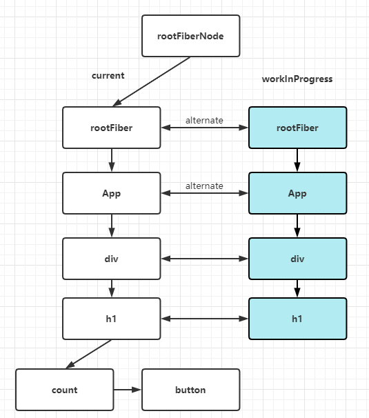

# 从源码理解setState

## 学前思考题:
1. React Hooks 为什么必须在函数组件内部执行？React 如何能够监听 React Hooks 在外部执行并抛出异常？
2. React Hooks 如何把状态保存起来？保存的信息存在了哪里？
3. React Hooks 为什么不能写在条件语句中？


## 注意
本文中源码对应的版本是React 16.13.1

## React Hooks与Fiber的关系

### 双缓存Fiber树
我们知道React16启用了全新的架构，叫做Fiber。在React中最多会同时存在两棵Fiber树，当前HTML页面对应有fiber树叫做current fiber 树，workInProgress fiber树是正在构建的fiber树。当workInProgress fiber树构建完成并渲染后，current指针会指向 workInProgress fiber树，此时workInProgress Fiber树就变为current Fiber树，这个就是双缓存Fiber树。

  <br><br>

### fiber与Hooks
fiber节点用 fiber.memoizedState 保存 hooks 信息。

### Hook对象
```typescript
type Hook = {
  memoizedState: any, // 保存state
  baseState: any,      
  baseQueue: Update<any, any> | null,
  queue: UpdateQueue<any, any> | null, 
  next: Hook | null, // 指向下一个hook，形成链表
};

type UpdateQueue<S, A> = {
  pending: Update<S, A> | null, //指向待更新的update
  dispatch: (A => mixed) | null,
  lastRenderedReducer: ((S, A) => S) | null,
  lastRenderedState: S | null,
};

type Update<S, A> = {
  expirationTime: ExpirationTime,
  suspenseConfig: null | SuspenseConfig,
  action: A,
  eagerReducer: ((S, A) => S) | null,
  eagerState: S | null,
  next: Update<S, A>,   
  priority?: ReactPriorityLevel,
};
```
Hook.memoizedState记录着当前当前节点的hooks信息，Hook通过Hook.next指针形成链表。

## HooksDispatcherOnMount、HooksDispatcherOnUpdate、ContextOnlyDispatcher

函数组件初始化和更新的过程中，hooks的代码逻辑是不一样的，主要原因是，执行React.useState()时，会从ReactCurrentDispatcher.current取值，而其值在不同情况下会变化。

ReactCurrentDispatcher.current 的值有三种情况：
1. 当初始化时，是 HooksDispatcherOnMount；
2. 当更新时，是 HooksDispatcherOnUpdate；
3. 当函数组件执行完后，会赋值为ContextOnlyDispatcher

- ContextOnlyDispatcher： 第一种形态是防止开发者在函数组件外部调用 hooks ，所以第一种就是报错形态，只要开发者调用了这个形态下的 hooks ，就会抛出异常。
- HooksDispatcherOnMount： 第二种形态是函数组件初始化 mount ，初次建立其 hooks 与 fiber 之间的关系。
- HooksDispatcherOnUpdate：第三种形态是函数组件的更新，既然与 fiber 之间的桥已经建好了，那么组件再更新，就需要 hooks 去获取或者更新维护状态。

函数 renderWithHooks里的逻辑 (ReactFiberHooks.js)
```javaScript
 ...
 // 当是第一次时，current === null || current.memoizedState === null 会为true，赋值HooksDispatcherOnMount
 // 当时后面更新时，则为HooksDispatcherOnUpdate
    ReactCurrentDispatcher.current =
      current === null || current.memoizedState === null
        ? HooksDispatcherOnMount
        : HooksDispatcherOnUpdate;

    let children = Component(props, secondArg); //执行函数组件
 
  // 函数组件执行完后，赋值ContextOnlyDispatcher，如果后面还有调用useState()，则会报错
    ReactCurrentDispatcher.current = ContextOnlyDispatcher;
 ...

```
HooksDispatcherOnMount、HooksDispatcherOnUpdate、ContextOnlyDispatcher对应的具体值如下：
```javascript
const HooksDispatcherOnMount = { /* 函数组件初始化用的 hooks */
    useState: mountState,
    useEffect: mountEffect,
    ...
}
const  HooksDispatcherOnUpdate ={ /* 函数组件更新用的 hooks */
   useState:updateState,
   useEffect: updateEffect,
   ...
}
const ContextOnlyDispatcher = {  /* 当hooks不是函数内部调用的时候，调用这个hooks对象下的hooks，所以报错。 */
   useEffect: throwInvalidHookError,
   useState: throwInvalidHookError,
   ...
}
```

## useState 初始化


## useState更新