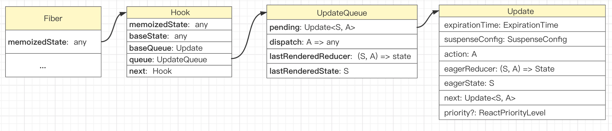
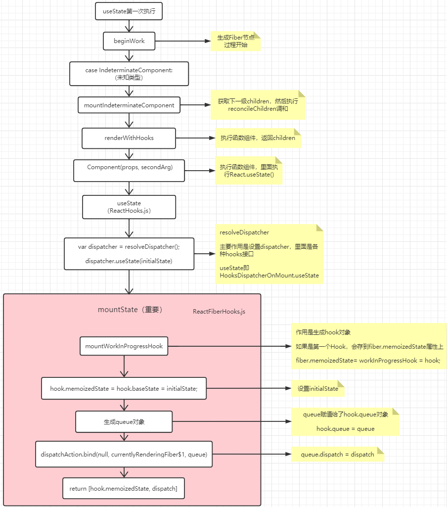
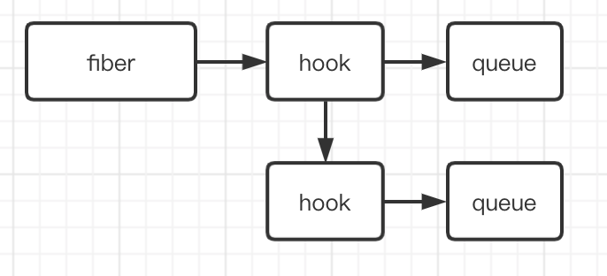
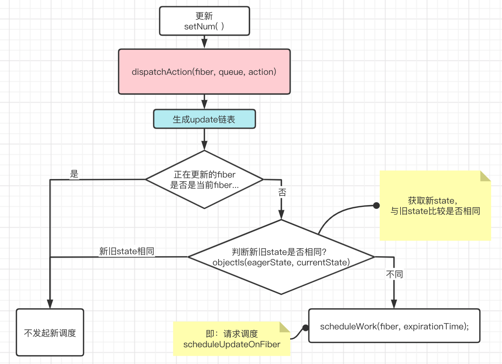
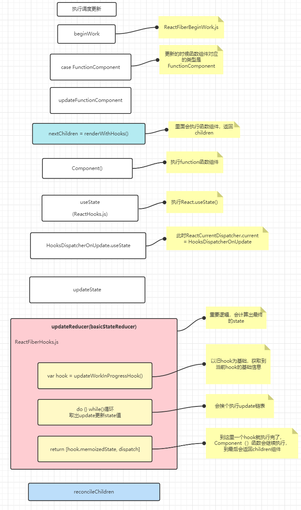
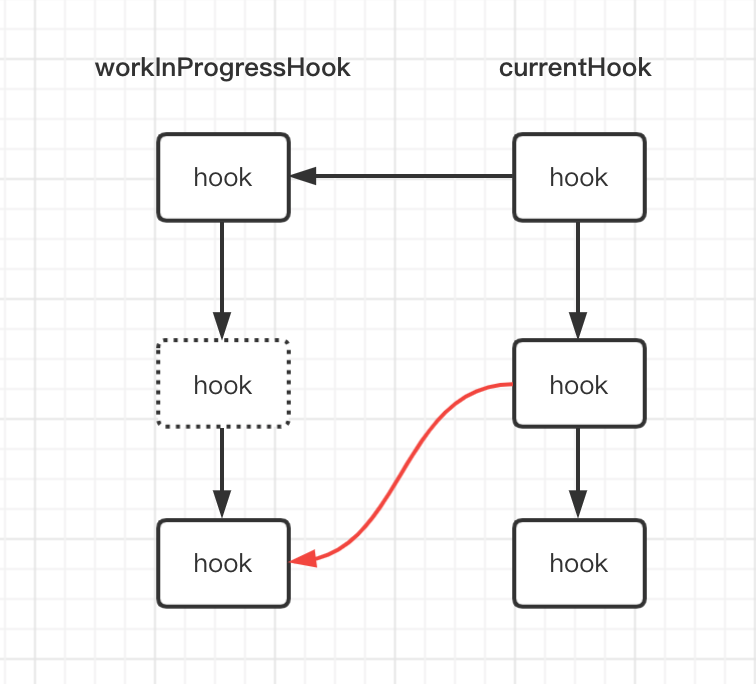

# 从源码理解useState

## 学前思考题:
1. React Hooks 为什么必须在函数组件内部执行？React 如何能够监听 React Hooks 在外部执行并抛出异常？
2. React Hooks 如何把状态保存起来？保存的信息存在了哪里？
3. React Hooks 为什么不能写在条件语句中？


## 注意
本文中源码对应的版本是React 16.13.1

## React Hooks与Fiber的关系

### 双缓存Fiber树
我们知道React16启用了全新的架构，叫做Fiber。在React中最多会同时存在两棵Fiber树，当前HTML页面对应有fiber树叫做current fiber 树，workInProgress fiber树是正在构建的fiber树。当workInProgress fiber树构建完成并渲染后，current指针会指向 workInProgress fiber树，此时workInProgress Fiber树就变为current Fiber树，这个就是双缓存Fiber树。

  <br><br>

### fiber与Hooks
fiber节点用 `fiber.memoizedState` 保存 hooks 信息。

### Hook对象
`fiber.memoizedState`记录着当前当前节点的hooks信息，Hook通过`Hook.next`指针形成链表。(注意：函数组件的fiber树的`fiber.memoizedState`存的hooks信息，但类组件的不一样)

  <br>

```typescript
type Hook = {
  memoizedState: any,       // 保存state
  baseState: any,      
  baseQueue: Update<any, any> | null,
  queue: UpdateQueue<any, any> | null, 
  next: Hook | null,        // 指向下一个hook，形成链表
};

type UpdateQueue<S, A> = {
  pending: Update<S, A> | null, //指向待更新的update
  dispatch: (A => mixed) | null,
  lastRenderedReducer: ((S, A) => S) | null,
  lastRenderedState: S | null,
};

type Update<S, A> = {
  expirationTime: ExpirationTime,
  suspenseConfig: null | SuspenseConfig,
  action: A,
  eagerReducer: ((S, A) => S) | null,
  eagerState: S | null,
  next: Update<S, A>,   
  priority?: ReactPriorityLevel,
};
```

## `HooksDispatcherOnMount`、`HooksDispatcherOnUpdate`
同样是执行`React.useState()`，**函数组件初始化和更新的过程中，hooks的代码逻辑是不一样的**，主要原因是，执行`React.useState()`时，会从`ReactCurrentDispatcher.current`取值，而该值会变化。执行`React.useState()`，实际上是执行`ReactHooks.js`中的 `useState(initialState)`函数，
```js
// 执行React.useState()就是执行的此函数
  function useState(initialState) {
    var dispatcher = resolveDispatcher();
    return dispatcher.useState(initialState);
  }

/** 获取当前的dispatcher，也即是 ReactCurrentDispatcher.current 的值 */
  function resolveDispatcher() {
    var dispatcher = ReactCurrentDispatcher.current;
    ...
    return dispatcher;
  }
```
**React就是通过改变`ReactCurrentDispatcher.current`的值，在不同状态下执行不同的Hooks逻辑**，改变的逻辑在`renderWithHooks()`中。

具体代码如下：(ReactFiberHooks.js)
```javaScript
renderWithHooks(){
 ...
 // 当是第一次时，判断逻辑会为true，赋值HooksDispatcherOnMount；更新时，会赋值HooksDispatcherOnUpdate
    ReactCurrentDispatcher.current =
      current === null || current.memoizedState === null
        ? HooksDispatcherOnMount
        : HooksDispatcherOnUpdate;

    let children = Component(props, secondArg); //执行函数组件
 
  // 函数组件执行完后，赋值ContextOnlyDispatcher，如果后面还有调用useState()，则会报错
    ReactCurrentDispatcher.current = ContextOnlyDispatcher;
 ...
 }
```

`ReactCurrentDispatcher.current` 的值有三种情况：
1. `ContextOnlyDispatcher`： 报错形态，只要开发者调用了这个形态下的 hooks ，就会抛出异常。
2. `HooksDispatcherOnMount`： 函数组件初始化 mount ，初次建立其 hooks 与 fiber 之间的关系。
3. `HooksDispatcherOnUpdate`：函数组件的更新，既然与 fiber 之间的桥已经建好了，那么组件再更新，就需要 hooks 去获取或者更新维护状态。

当初始化时，是 `HooksDispatcherOnMount`；当更新时，是 `HooksDispatcherOnUpdate`；当函数组件执行完后，会赋值为`ContextOnlyDispatcher`，此时如果再执行`React.useState()`，那么会是`throwInvalidHookError`，会报错。


`HooksDispatcherOnMount`、`HooksDispatcherOnUpdate`、`ContextOnlyDispatcher`对应的具体值如下：
```javascript
const HooksDispatcherOnMount = { /* 函数组件初始化用的 hooks */
    useState: mountState,   //初始化时执行
    useEffect: mountEffect,
    ...
}
const  HooksDispatcherOnUpdate ={ /* 函数组件更新用的 hooks */
   useState: updateState, // 更新时执行
   useEffect: updateEffect,
   ...
}
const ContextOnlyDispatcher = {  /* 当hooks不是函数内部调用的时候，调用这个hooks对象下的hooks，所以报错。 */
   useEffect: throwInvalidHookError,
   useState: throwInvalidHookError,  // 抛出一个错误
   ...
}
```

## useState 第一次执行
当组件初次加载时，从`beginWork`开始构建fiber节点，期间会执行函数组件，然后会执行函数组件里的`React.useState()`，一直到`mountState`。初次加载时，`useState`的重要逻辑在`mountState`中，创建了`hook`对象和`queue`对象，初始化`state`值，到最后返回`state` 和 `dispatchAction`（绑定了当前fiber节点和queue 到 dispatchAction）。

```js
  function mountState(initialState) {

    var hook = mountWorkInProgressHook(); // 生成Hook对象，如果是第一个Hook，会存到fiber.memoizedState属性上

    if (typeof initialState === 'function') {
      initialState = initialState();
    }

    hook.memoizedState = hook.baseState = initialState; //  初始化state

    var queue = hook.queue = {  // 初始化queue
      pending: null,
      dispatch: null,
      lastRenderedReducer: basicStateReducer,
      lastRenderedState: initialState
    };
    
    // 把当前的fiber节点和queue 绑定到 dispatchAction （更新的时候用）
    var dispatch = queue.dispatch = dispatchAction.bind(null, currentlyRenderingFiber$1, queue);
    
    return [hook.memoizedState, dispatch];
  }
```
  <br><br>

至此，第一次执行React.useState就完成了，初始化完成后会形成如下数据结构：

  <br> 

## useState更新

更新分为两部分：
1. dispatchAction
2. 调度更新
### 1，dispatchAction

通过上面的`useState`的初始化过程得知，`useState`最后返回的是` [hook.memoizedState, dispatchAction]`。

```js
 const [num, setNum] = React.useState(100); // [hook.memoizedState, dispatch]
```
那么我们去更新`state`的时候，`setNum()`其实执行就是`dispatchAction`（注意：返回的dispatchAction是绑定了fiber节点和queue的参数的）。

看一下`dispatchAction`的逻辑：

  <br><br>

```typescript
function dispatchAction(fiber: Fiber,queue: UpdateQueue, action) {
  ...
  const update: Update> = {  // 创建update对象
    ...
    action,    // 即 setNum()的传参,存在了update对象中
    eagerReducer: null,
    eagerState: null,
    next: (null: any),
  };

  // 将update对象通过next串起来形成update链表，queue.pending指向update链表
  const pending = queue.pending;

  update.next = pending.next;
  pending.next = update;

  queue.pending = update;

  // 正在更新的fiber node是否是当前fiber
  if (fiber === currentlyRenderingFiber || (alternate !== null && alternate === currentlyRenderingFiber)) {
     ... 
    // 说明当前fiber正在发生调和渲染更新，那么不需要更新,不发起新调度
  } else {
    if (fiber.expirationTime === NoWork && (alternate === null || alternate.expirationTime === NoWork)) {
        var currentState = queue.lastRenderedState; // 更新前的state
        var eagerState = lastRenderedReducer(currentState, action);  // 计算一下更新后的state（action会被执行）

        if (objectIs(eagerState, currentState)) { // 如果更新前后state相同，不发起更新
          return;
        }
    }
    scheduleWork(fiber, expirationTime); // scheduleWork是scheduleUpdateOnFiber，会发起更新调度
}
```
通过上面的逻辑我们可以知道，当比较更新前后的state是一样的时候，是不会发起更新的。（也可以知道，如果setNum()的入参是个函数，那么不管state是否相同，都是会被执行的）

总结一下：**`dispatchAction `作用有两个：1，生成update链表。2，发起更新调度** 

执行完后，内存中的数据结构如下：

  <br><br>

### 2，执行调度更新 
```js
const scheduleWork = scheduleUpdateOnFiber
```
`dispatchAction`会调用`scheduleWork`，即`scheduleUpdateOnFiber`，会发起更新调度。

  <br><br>

会发起更新调度后，会构建workInProgress Fiber树，后面又会到`beginWork()`函数，不过这一次会进入到`case FunctionComponent`分支，但是里面也是会执行`renderWithHooks()`，跟初始化时的逻辑一样。
```js
    ReactCurrentDispatcher.current =
      current === null || current.memoizedState === null
        ? HooksDispatcherOnMount
        : HooksDispatcherOnUpdate;
```
不同的是此时判断条件会为`false`，因为现在是更新，所以 `ReactCurrentDispatcher.current = HooksDispatcherOnUpdate`，此时执行`useState`取的是`HooksDispatcherOnUpdate.useState`，逻辑走的是`updateState`的，最后实际执行的是`updateReducer()`。
 ```js
   function updateState(initialState) {
    return updateReducer(basicStateReducer);
  }
 ```
 `updateReducer()`是useState更新阶段很重要的一段逻辑，在这里会把hook上的update链表依次执行，得出最终的state返回去，这样函数组件中就能获取到更新后的state。
 ```js
 function updateReducer(reducer, initialArg, init) {
 
  const hook = updateWorkInProgressHook(); // 以旧hook为基础，获取到当前hook的基础信息
   ...
   // 把待更新的pending队列取出来
   ...
   
    do {   // 依次从update链表中取出update.action执行，得出最终的的state
      const action = update.action;

      newState = reducer(newState, action);

      update = update.next;
    } while (update !== null && update !== first);

    // 保存当前的state状态
    hook.memoizedState = newState;
    hook.baseState = newBaseState;
 
    ...

  const dispatch = queue.dispatch;
  return [hook.memoizedState, dispatch];
}
 ```
 总结一下：`updateReducer()`的功能就是：**把在`dispatchAction`中生成的`update`链表取出来，在` do while {} `循环中挨个执行，从而得出最终的state，即是函数组件中useState得到的值。**

## 为什么hooks不能写在if条件语句中呢？
在`updateReducer`中，`updateWorkInProgressHook`是以current fiber树上的hooks（旧hook）为基础，复用基础信息，然后得到一个当前的newHook，也就是workInProgressHook。
```js
function updateWorkInProgressHook() {
  ...
    nextCurrentHook = currentHook.next; // currentHook是current fiber树上的hooks链表
  ...
    currentHook = nextCurrentHook;
    
    const newHook: Hook = {  // 以current hook为基础，复用基本信息，构建workInProgressHook
      memoizedState: currentHook.memoizedState,

      baseState: currentHook.baseState,
      baseQueue: currentHook.baseQueue,
      queue: currentHook.queue,
      next: null,
    };

    workInProgressHook = workInProgressHook.next = newHook;

  return workInProgressHook;
}
```
从`nextCurrentHook = currentHook.next`可以看到，更新的时候每次执行useState，都会从current树上的hooks链表中取一个`hook.next`来复用。如果写了`if`条件语句，依次用`next`取值的时候，就会错位。

  <br><br>


总结：
1. Hook会形成链表，`fiber.memoizedState`会指向该链表（对于函数组件的fiber是这样，class组件的`fiber.memoizedState`存的是别的东西）
2. `setNum()`实际执行的是`dispatchAction`，会产生update链表，`hook.queue.pending` 指向update链表
3. `setNum()`会发起一个新的更新调度
4. `useState`更新的时候，会把update链表取出来依次执行，得到最终的state。

**当在函数组件里使用自定义hooks时，自定义hooks里面的hook也会挂在Hook链表上。**

<br>

# 参考资料：

 搭建阅读React源码调试环境 : https://github.com/Terry-Su/debug-react-source-code#readme

 React源码学习：https://react.iamkasong.com/#%E5%AF%BC%E5%AD%A6%E8%A7%86%E9%A2%91

 掘金小册：《React 进阶实践指南》 (付费)